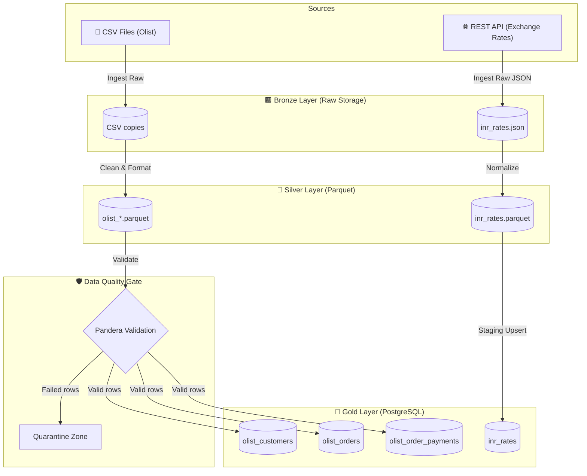
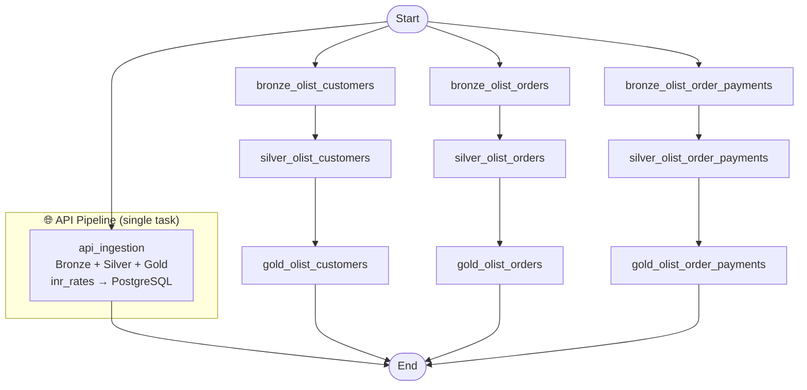
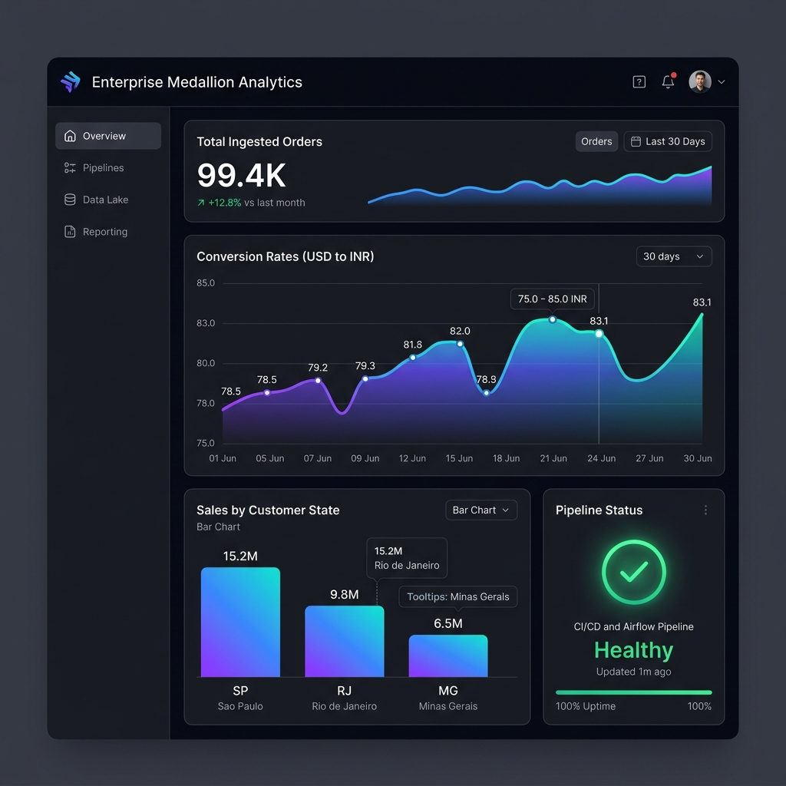

# 🚀 Production-Grade Medallion ETL & Data Engineering Pipeline

An end-to-end local data engineering pipeline modernizing a traditional Medallion Architecture (Bronze → Silver → Gold) to load, validate, optimize, and orchestrate e-commerce datasets and exchange-rate REST APIs. 

Designed for scalability, auditability, and production-ready deployments on macOS (running natively within a Python virtual environment without requiring Docker).

---

## 🏛️ Architecture Overview

The pipeline implements the industry-standard **Medallion Architecture**, organizing data into three logical layers to systematically improve quality and structure:



### 1. 🟫 Bronze Layer (Raw Storage)
* **Goal**: Store ingestion sources exactly as they arrive from the source, maintaining historical auditability.
* **Storage**: 
  * CSV files copied to [data/bronze/csv_store/](file:///Users/kevinshah/Desktop/project/data/bronze/csv_store)
  * Raw exchange rate JSON saved to [data/bronze/api_store/inr_rates.json](file:///Users/kevinshah/Desktop/project/data/bronze/api_store/inr_rates.json)

### 2. 🥈 Silver Layer (Cleaned & Optimized)
* **Goal**: Cast types, drop duplicates, normalize nested structures, and convert records to a columnar storage format.
* **Optimization**: Stores files in **Apache Parquet** format. Parquet provides columnar compression, faster read performance, and embedded schema definitions.
* **Storage**:
  * Cleaned datasets saved to [data/silver/csv_store/](file:///Users/kevinshah/Desktop/project/data/silver/csv_store)
  * Parsed exchange rate rates saved to [data/silver/api_store/inr_rates.parquet](file:///Users/kevinshah/Desktop/project/data/silver/api_store/inr_rates.parquet)

### 3. 🥇 Gold Layer (PostgreSQL Database Warehouse)
* **Goal**: Consolidate cleaned analytics-ready data in a relational format supporting database constraints, indexes, and complex BI queries.
* **Storage**: Native PostgreSQL tables:
  * `olist_customers` — e-commerce customer records
  * `olist_orders` — order lifecycle events
  * `olist_order_payments` — aggregated payment values
  * `inr_rates` — live INR exchange rates (sourced from REST API)

---

## 🛡️ Data Quality Gates (Pandera Schema Validation)

To protect the Gold warehouse from corrupt or irregular data, we enforce rigorous schemas at the transition between the Silver and Gold layers using the `pandera` library.

### Enforced Rules
We define and run validation schemas inside [schemas.py](file:///Users/kevinshah/Desktop/project/ingestion/schemas.py):
1. **Customers Schema (`olist_customers`)**:
   * `customer_id`: Unique, string, not nullable.
   * `customer_unique_id`: String, not nullable.
   * `customer_zip_code_prefix`: Integer, not nullable.
   * `customer_city`: String, not nullable.
   * `customer_state`: String, not nullable, length must be exactly 2 characters.
2. **Orders Schema (`olist_orders`)**:
   * `order_id`: Unique, string, not nullable.
   * `customer_id`: String, not nullable.
   * `order_status`: String, not nullable.
   * `order_purchase_timestamp`: Timestamp/datetime, not nullable.
   * `order_approved_at`: Timestamp/datetime, nullable.
   * `order_delivered_carrier_date`: Timestamp/datetime, nullable.
   * `order_delivered_customer_date`: Timestamp/datetime, nullable.
   * `order_estimated_delivery_date`: Timestamp/datetime, nullable.
3. **Payments Schema (`olist_order_payments`)**:
   * `order_id`: Unique string, not nullable.
   * `payment_value`: Float, not nullable, value must be `>= 0.0`.

### ☣️ Quarantine Isolation Behavior
Instead of failing the entire pipeline run when corrupt records are detected (lazy validation), the gate:
1. Catches schema validation failures.
2. Extracts failed rows and writes them to the **Quarantine Zone** CSV file: `data/quarantine/<dataset_name>_failures.csv`.
3. Isolates/filters out the corrupt rows.
4. Proceeds with loading **only valid rows** to the Gold layer, avoiding processing bottlenecks.

---

## ⚡ Database-Native Staging & Upsert Strategy

To avoid destructive writes (like `.to_sql(if_exists="replace")` which drops PostgreSQL tables and deletes indexes/constraints), this project implements a database-native **Staging Upsert** (`INSERT ... ON CONFLICT DO UPDATE`) strategy inside [postgre_store.py](file:///Users/kevinshah/Desktop/project/storage/postgre_store.py):

1. **Staging Creation**: Cleaned silver data is loaded into a transient staging table: `temp_stage_<table_name>`.
2. **Target Setup**: A permanent target table is created if it does not exist with explicit types, primary keys, and constraints.
3. **Native SQL Merge**: An explicit `INSERT INTO ... SELECT ... ON CONFLICT DO UPDATE` query is executed at the database level, mapping columns and overwriting existing rows with matching primary keys.
4. **Staging Cleanup**: The staging table `temp_stage_<table_name>` is dropped.

---

## 🌀 Production-Grade Orchestration: Apache Airflow

The pipeline runs are managed and orchestrated by a local **Apache Airflow 2.9.1** setup.



> **Note on API task design**: The `api_ingestion` Airflow task runs `api_ingest.main()` as a single atomic unit covering all three layers (Bronze JSON → Silver Parquet → Gold PostgreSQL). CSV datasets are split into three separate per-layer tasks (`bronze_*`, `silver_*`, `gold_*`) to allow granular retries at each layer independently.

### Key Airflow Features

* **Directed Acyclic Graph (DAG)**: The workflow is configured in [medallion_etl.py](file:///Users/kevinshah/Desktop/project/airflow/dags/medallion_etl.py).
* **Decoupled Task execution**: Each CSV table processes independently through its own sequential layers (`Bronze -> Silver -> Gold`). If a database load fails for a specific table in Gold, you can retry *only* the failing loading task without re-running any CSV downloads or silver transformations.
* **Parallel Execution**: All Bronze tasks and API ingestion run in parallel, maximizing local CPU utilization.
* **Retry Policies**:
  * **API Ingestion**: Configured with 3 retries, a base delay of 1 minute, and **exponential backoff** to handle transient network issues or API rate limits gracefully.
  * **CSV Layers**: Layer transitions configured with automatic retries and 30-second delays.

---

## 📊 Live Interactive BI Analytics Dashboard

The project includes a built-in, local **BI Analytics Dashboard** web application to monitor PostgreSQL Gold table statistics, view currency trends, and track logging outputs.



### Key Dashboard Features:
1. **Dynamic Statistics Cards:** Tailored metrics querying `olist_orders`, `olist_customers`, and `olist_order_payments` from the local PostgreSQL warehouse.
2. **Interactive Visualizations (Chart.js):**
   * *USD/INR Exchange Rates:* Line chart displaying filtered conversion rates relative to INR (USD, EUR, GBP, JPY, CAD, INR).
   * *Sales by Customer State:* Horizontal bar chart displaying the top 5 generating states.
3. **Live Logs Monitor:** Dynamically streams the last 5 log events from `logs/pipeline.log`.
4. **ETL Pipeline Trigger Control:** Clicking the **Trigger Pipeline** action button triggers the pipeline execution script asynchronously in the background.

To start the dashboard, run:
```bash
python3 dashboard_server.py
```
Open **[http://localhost:5050](http://localhost:5050)** in your browser.

---

## 📁 Project Directory Structure

```text
/Users/kevinshah/Desktop/project
├── .env                       # Environment credentials & API keys (ignored in Git)
├── Dockerfile                 # Container image specification (optional portability)
├── docker-compose.yml         # Container services orchestrator (optional)
├── main.py                    # CLI-based main pipeline orchestration entry point
├── requirements.txt           # Declared python dependencies
├── start_airflow.sh           # Executable wrapper service for local Airflow services
├── task_timeline.md           # Project roadmap, history, and status log
├── airflow/                   # Custom AIRFLOW_HOME directory
│   ├── airflow.db             # Local SQLite metadata database
│   ├── airflow.cfg            # Global Airflow configuration settings
│   ├── dags/                  # Airflow pipelines definitions directory
│   │   └── medallion_etl.py   # Airflow DAG for Medallion pipeline orchestration
│   └── logs/                  # Execution log dumps for all pipeline runs
├── config/
│   └── settings.py            # Central settings module using Pydantic Settings
├── data/                      # File-system storage layer
│   ├── bronze/                # Raw copy of ingested files (CSV + JSON)
│   ├── silver/                # Cleaned column-optimized storage (Parquet)
│   └── quarantine/            # Captured row-level validation failure files
├── dataset/                   # Project landing zone for source datasets
│   ├── olist_customers_dataset.csv
│   ├── olist_order_payments_dataset.csv
│   └── olist_orders_dataset.csv
├── ingestion/                 # Extract & Transform (Bronze -> Silver) python modules
│   ├── api_ingest.py          # REST API extractor for currency exchange rates
│   ├── csv_ingest.py          # Local CSV processor and Pandera quality gate
│   └── schemas.py             # Pandera schema models definitions
├── storage/                   # Load (Silver -> Gold) python modules
│   ├── parquet_store.py       # Helper functions to convert dataframes to Parquet
│   └── postgre_store.py       # Staging-based PostgreSQL loader and Upsert executor
└── test/                      # Ingestion pipeline unit tests
    └── test_csv_ingest.py     # Pytest test cases for cleaning/transforming utilities
```

---

## ⚙️ Local Installation & Setup Guide

This guide is structured for beginners to set up the development environment from scratch on macOS.

### 1. Prerequisites
Ensure you have the following installed on your machine:
* **Python 3.12** (Verify with `python3 --version`)
* **PostgreSQL Server** (Running locally on port 5432)

### 2. Navigate and Create Virtual Environment
Open terminal, navigate to the project directory, and initialize a Python virtual environment (`venv`) to keep dependencies isolated:
```bash
cd /Users/kevinshah/Desktop/project
python3 -m venv venv
source venv/bin/activate
```

### 3. Install Locked Dependencies
```bash
pip install -r requirements.txt
```
*Note: This locks `pandas==2.1.4` and `numpy==1.26.4` to align with Airflow's requirement for SQLAlchemy `1.4.x`.*

### 4. Create local PostgreSQL Database
Log in to your local PostgreSQL instance and create the target database matching the settings file:
```sql
CREATE DATABASE enterprise_data;
```

### 5. Setup Environment Variables
Create a file named `.env` in the root project directory:
```env
Exchange_Rate_API_KEY=fb2e5a8bc971a7e06d7192f2
DB_NAME=enterprise_data
DB_USER=postgres
DB_PASSWORD=your_postgres_password
DB_HOST=127.0.0.1
DB_PORT=5432
```
*(Replace `postgres` and `your_postgres_password` with your local PostgreSQL username and password)*

---

## 🏃 Run the Pipeline

There are four ways to run and interact with this project:

### Option A: Interactive BI Dashboard (Best Visual Presentation)
To launch the real-time business intelligence dashboard web application:
```bash
source venv/bin/activate
python3 dashboard_server.py
```
Open **[http://localhost:5050](http://localhost:5050)** in your web browser.

### Option B: Direct CLI Execution (Manual Run)
To trigger a manual run of the entire ingestion and loading process using Python scripts:
```bash
source venv/bin/activate
python3 main.py
```
Check the execution logs at [logs/pipeline.log](file:///Users/kevinshah/Desktop/project/logs/pipeline.log).

### Option C: Apache Airflow (Orchestrated Run)
1. **Start Airflow Webserver and Scheduler**:
   ```bash
   ./start_airflow.sh start
   ```
2. **Access the Airflow Web UI**:
   * Open your browser and navigate to: `http://localhost:8080`
   * Log in with credentials: User: `admin` | Password: `admin`
3. **Trigger the Pipeline**:
   * Locate the `medallion_etl_pipeline` DAG.
   * Toggle it to **Active** (unpause).
   * Click **Trigger DAG** (play button) to execute the parallel pipeline.
4. **Stop Airflow**:
   * When finished, stop background processes by running:
     ```bash
     ./start_airflow.sh stop
     ```
   * Check status at any time: `./start_airflow.sh status`

### Option D: Run Unit Tests
To verify the cleaning functions and validation structures:
```bash
source venv/bin/activate
PYTHONPATH=. pytest
```

---

## 🛠️ Tech Stack & Key Libraries

* **Python 3.12**: Core runtime environment.
* **Pandas (2.1.4)**: Data cleaning, reshaping, aggregation, and formatting.
* **Pandera (0.18.0)**: Declarative runtime schemas enforcement.
* **SQLAlchemy (1.4.52)**: Object-Relational Mapping (ORM) and engine database pooling.
* **Apache Airflow (2.9.1)**: Workflow management, DAG parsing, and parallel scheduler execution.
* **Pytest (8.0.0)**: Unit test suite execution framework.
* **Pyarrow (24.0.0)**: Apache Parquet read/write driver.
* **Pydantic Settings**: Case-insensitive environment configuration loader.