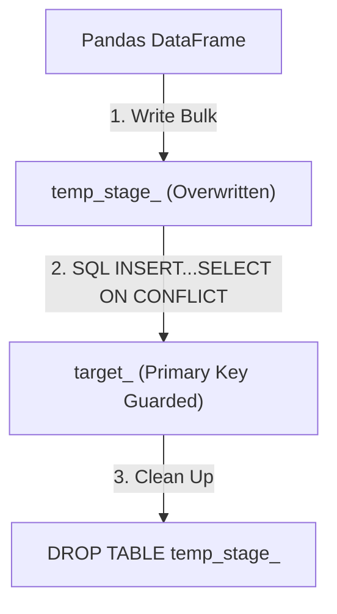

# Project Walkthrough: Current Stage Technical Explanation

This document explains the technical details, design patterns, and code implementations completed during the current stage of the project.

---

## 1. Pipeline Orchestration & Entry Points

### The Initial Problem
Previously, when files like [api_ingest.py](file:///Users/kevinshah/Desktop/project/ingestion/api_ingest.py) were imported, all the code inside them (e.g. sending network requests to the exchange API and writing JSON files) ran immediately. Additionally, [main.py](file:///Users/kevinshah/Desktop/project/main.py) was only an import statement, meaning running the main file did not execute the full pipeline.

### The Technical Solution
We wrapped the ETL steps inside independent `main()` functions:
- **`ingestion/api_ingest.py`**: The API call and file storage logic are now placed inside a `def main():` block. It will only run when directly executed or when its `main()` function is explicitly called.
- **`main.py`**: Acts as a central orchestrator. It imports both pipelines and executes them in sequence:
  ```python
  from ingestion.csv_ingest import main as run_csv_pipeline
  from ingestion.api_ingest import main as run_api_pipeline

  def main():
      run_csv_pipeline()
      run_api_pipeline()
  ```

---

## 2. High-Performance SQL Staging & Upserts

### The Initial Problem
Originally, your database loader in [storage/postgre_store.py](file:///Users/kevinshah/Desktop/project/storage/postgre_store.py) was configured with `if_exists="replace"`.
Every time the pipeline ran:
1. PostgreSQL dropped the target tables.
2. PostgreSQL recreated the tables from scratch.
3. This destroyed all table indexes, primary key constraints, foreign key relationships, database views, and historical records.

### The Technical Solution (Staging Table Strategy)
To keep the code clean and easy to read while maintaining production performance, we implemented a **Staging Table Upsert Strategy** inside [storage/postgre_store.py](file:///Users/kevinshah/Desktop/project/storage/postgre_store.py):



#### Step-by-Step Breakdown of the Database Load Logic:

1. **Staging Bulk Load**:
   First, we save the DataFrame into a temporary staging table named `temp_stage_<table_name>` using Pandas' standard bulk writer.
   ```python
   staging_table = f"temp_stage_{table_name}"
   df.to_sql(staging_table, engine, if_exists="replace", index=False)
   ```
   *Why*: This is extremely fast because it is a direct bulk load into a temp table rather than writing row-by-row.

2. **Schema Protection**:
   If the target table does not exist yet (e.g. on the first run), we create it with correct database types and set its **Primary Key** constraint so that PostgreSQL knows how to identify duplicates.
   ```sql
   CREATE TABLE IF NOT EXISTS olist_customers (
       customer_id VARCHAR PRIMARY KEY,
       customer_unique_id VARCHAR,
       customer_zip_code_prefix INT,
       customer_city VARCHAR,
       customer_state VARCHAR
   );
   ```

3. **Atomic SQL Upsert**:
   We execute a database-side merge (`ON CONFLICT`). It inserts new records, but if a primary key conflict occurs, it updates the existing row with the incoming staging table data.
   ```sql
   INSERT INTO olist_customers (customer_id, customer_unique_id, customer_zip_code_prefix, customer_city, customer_state)
   SELECT customer_id, customer_unique_id, customer_zip_code_prefix, customer_city, customer_state 
   FROM temp_stage_olist_customers
   ON CONFLICT (customer_id) 
   DO UPDATE SET 
       customer_unique_id = EXCLUDED.customer_unique_id,
       customer_zip_code_prefix = EXCLUDED.customer_zip_code_prefix,
       customer_city = EXCLUDED.customer_city,
       customer_state = EXCLUDED.customer_state;
   ```
   *Why*: Doing this directly inside PostgreSQL is hundreds of times faster than doing it in Python.

4. **Cleanup**:
   Finally, we drop the temporary staging table so we do not leave garbage behind in the database:
   ```sql
   DROP TABLE IF EXISTS temp_stage_<table_name>;
   ```

---

## 3. How to Run and Verify

1. **Verify your database credentials** are correct inside your [.env](file:///Users/kevinshah/Desktop/project/.env) file.
2. **Execute the pipeline** from your workspace terminal:
   ```bash
   python3 main.py
   ```
3. **Verify the outputs**:
   - The CSV ingestion pipeline will read, clean, and write Olist datasets to Silver Parquet, and upsert them to PostgreSQL.
   - The Exchange Rate API pipeline will pull exchange rates, save the Bronze JSON, and convert the output to Silver Parquet.
