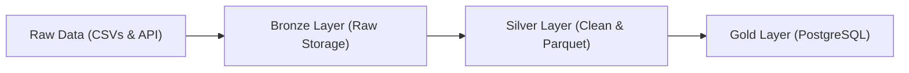
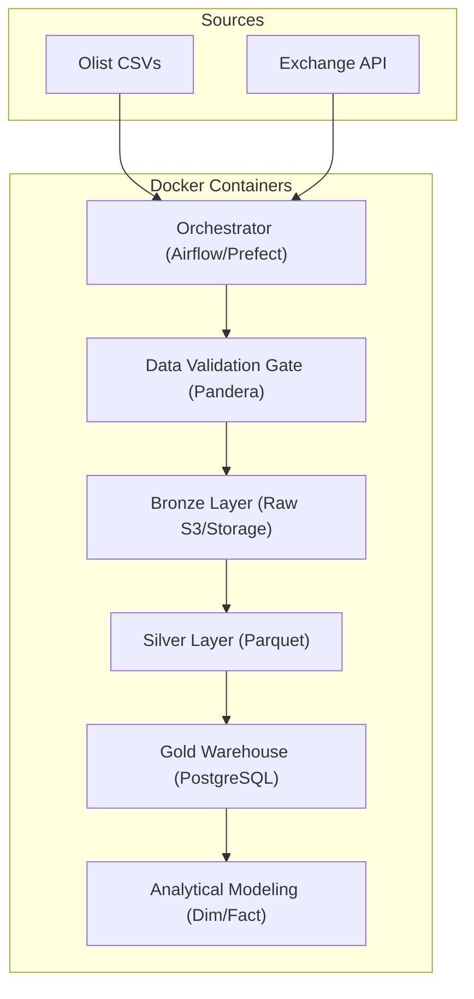

# ETL Pipeline Analysis & Industry-Grade Roadmap

This document analyzes your current ETL pipeline implementation, identifies architectural gaps, and provides an actionable blueprint to elevate it to a production-grade data engineering project.

---

## 1. What You Have Built (Medallion Architecture)

Your current pipeline is structured around the classic **Medallion (Bronze ➔ Silver ➔ Gold) Architecture**, which is standard across modern data platforms.

### Bronze Layer (Raw Ingestion)
*   **Multi-Source Extraction**:
    *   **CSV Ingestion**: In [csv_ingest.py](file:///Users/kevinshah/Desktop/project/ingestion/csv_ingest.py), you copy e-commerce data from [dataset/](file:///Users/kevinshah/Desktop/project/dataset) directly to a local Bronze store ([data/bronze/csv_store/](file:///Users/kevinshah/Desktop/project/data/bronze)).
    *   **API Ingestion**: In [api_ingest.py](file:///Users/kevinshah/Desktop/project/ingestion/api_ingest.py), you fetch exchange rates from an external API and persist the raw JSON payload to [data/bronze/api_store/inr_rates.json](file:///Users/kevinshah/Desktop/project/data/bronze).
*   **Why this is good**: Storing raw immutable files first ensures you can replay or debug transformations without querying external APIs again.

### Silver Layer (Cleaning & Parquet Format)
*   **Data Quality & Cleaning**: In [csv_ingest.py](file:///Users/kevinshah/Desktop/project/ingestion/csv_ingest.py), you apply pandas cleanups including lowercasing columns, removing duplicates, stripping string whitespace, converting timestamps, and aggregating payments.
*   **Storage Optimization**: In [parquet_store.py](file:///Users/kevinshah/Desktop/project/storage/parquet_store.py), you write the output using **Apache Parquet**.
*   **Why this is good**: Parquet is a columnar storage format. It heavily compresses files and retains data types, optimizing downstream analytical queries.

### Gold Layer (Relational Loading)
*   **Warehouse Ingest**: In [postgre_store.py](file:///Users/kevinshah/Desktop/project/storage/postgre_store.py), you use `SQLAlchemy` to load Parquet files into a local PostgreSQL database (`enterprise_data`).
*   **Why this is good**: Storing analytical-ready datasets in relational databases allows downstream BI tools or data analysts to query them using SQL.

---

## 2. Code Review & Immediate Architectural Gaps

While your project has a clean separation of concerns, top-tier data engineering roles require addressing the following limitations:

### A. Destructive Writes (`if_exists="replace"`) — ✅ RESOLVED
*   **Issue**: In [postgre_store.py](file:///Users/kevinshah/Desktop/project/storage/postgre_store.py), `if_exists="replace"` completely dropped database tables and recreated them, breaking relational integrity, dropping indexes, and being highly inefficient in production.
*   **Solution**: Refactored to use a **Staging Upsert** (`INSERT ... SELECT ... ON CONFLICT DO UPDATE`) strategy for all four Gold tables.

### B. Isolated API Pipeline — ✅ RESOLVED
*   **Issue**: [api_ingest.py](file:///Users/kevinshah/Desktop/project/ingestion/api_ingest.py) only wrote to Bronze and Silver layers. Exchange rate data never reached the Gold PostgreSQL warehouse.
*   **Solution**: Added the `inr_rates` upsert block to [postgre_store.py](file:///Users/kevinshah/Desktop/project/storage/postgre_store.py) and wired `put_in_postgre(df_silver, "inr_rates")` in `api_ingest.py` after the Parquet write. Verified with a successful run on 2026-05-28.

### C. Lack of Orchestration & Scheduling
*   **Issue**: Execution relies on running python scripts sequentially. If any step fails halfway, there is no state recovery or retry mechanism.
*   **Solution**: Implement an orchestrator like **Apache Airflow**, **Prefect**, or **Dagster**.

### D. Environment Isolation & Setup Complexity
*   **Issue**: The PostgreSQL instance is expected to be running on your local machine. This makes it difficult for someone else to clone and run.
*   **Solution**: Containerize the database, orchestrator, and application using **Docker Compose**.

### E. No Quality Control or Testing
*   **Issue**: If an incoming CSV format changes or contains nulls, the pipeline will write dirty data to the database or crash. The [test/](file:///Users/kevinshah/Desktop/project/test) folder is empty.
*   **Solution**: Introduce **Pandera** or **Great Expectations** for schema validation, and write unit tests with **pytest**.

---

## 3. Industry-Standard Architecture Blueprint

To make this project stand out to top companies, we will refactor it towards the following target state:

---

## 4. Action Plan / Implementation Phases

### Phase 1: Environment & Infrastructure (Dockerization)
*   Create a `Dockerfile` for your Python ETL logic.
*   Create a `docker-compose.yml` defining services for a PostgreSQL database and an Apache Airflow or Prefect container.
*   *Outcome*: Anyone can deploy your entire data stack locally by running `docker-compose up`.

### Phase 2: Schema Validation (Data Quality)
*   Define Pandera schemas for `olist_customers`, `olist_orders`, and `olist_order_payments` to check for data types, non-nullable fields, and values range.
*   *Outcome*: Prevents schema drift and corrupted data from writing to downstream layers.

### Phase 3: Analytical Data Modeling (Star Schema & Upserts)
*   Design custom SQL or SQLAlchemy models for database tables.
*   Establish explicit constraints: primary keys, foreign keys, and indexes.
*   Replace Pandas `.to_sql(if_exists="replace")` with an upsert logic (`ON CONFLICT DO UPDATE`).
*   *Outcome*: Efficient, incremental loading that mirrors real-world warehouse operations.

### Phase 4: Production Orchestration (Airflow/Prefect DAGs)
*   Define task dependencies (Ingest ➔ Clean ➔ Validate ➔ Load) using Airflow Operators or Prefect Tasks.
*   Set up automatic retries for the external API ingestion.

### Phase 5: Testing & CI/CD
*   Write unit tests inside the [test/](file:///Users/kevinshah/Desktop/project/test) folder for your cleaner functions using `pytest`.
*   Configure a GitHub Actions workflow to run code linting and test coverage check automatically on every push.
